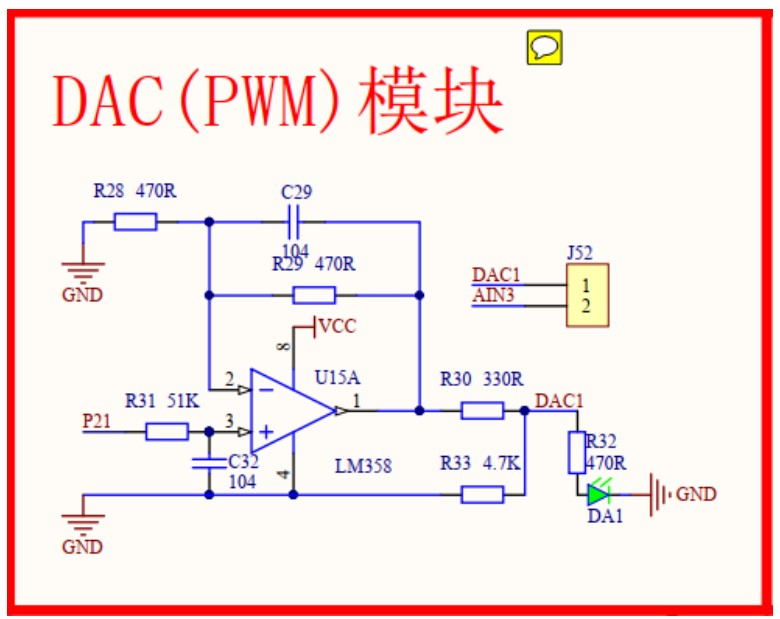

## Task 23: DAC Interfacing (Generating a DC Voltage Using PWM)

#### Overview
This task involves generating a DC voltage using PWM and converting it through a low-pass filter circuit based on the **LM358** operational amplifier, which is present in the STC development kit. The PWM signal (0-100% duty cycle) on pin **P21** will be converted into a 0-5V DC voltage.

#### Instructions

1. **Watch the PWM-to-DC Conversion Video:**
   - Watch this [video](https://www.youtube.com/watch?v=6rDwfFuAUD0&ab_channel=EngrEdu) to understand how PWM signals can be converted to a DC voltage using a low-pass filter.

2. **PWM Generation Function:**
   - Write a function that takes a **0-100** value as input and generates a PWM signal on pin **P21**. The value will represent the PWM duty cycle (0% = 0V, 100% = 5V).

3. **Signal Observation:**
   - Use a **logic analyzer** or an **oscilloscope** to observe the generated PWM signal.
   - Measure the DC voltage on point **DAC1** in the LM358 circuit using a voltmeter. The voltage should vary as the duty cycle changes.
   - Verify that the brightness of **LED DA1** changes with the PWM signal.

4. **ADC Interfacing with DAC Output:**
   - Close the **J52 jumper** to supply the generated DC voltage from the DAC circuit to the **AIN3 input** of the ADC.
   - Read the voltage generated by the DAC via the **AIN3** pin of the ADC and display it on the **LCD**.

5. **Basic DC Power Supply Design:**
   - Use **key K1** to **decrease** the PWM duty cycle and **key K2** to **increase** it.
   - Display the DAC output voltage on the **LCD** as well as on a **digital voltmeter**.
   - This setup simulates a basic DC power supply for small electronic circuits.

6. **Advanced DC Power Supply Design:**
   - Use the **keypad** on the STC development kit to enter a value between **0-5 volts** (including decimal points).
     - Example: If the user enters **2.3**, the DAC circuit should generate a **2.3V** DC output.
   - Caution: This power supply is for small loads only. Avoid connecting heavy loads as the current capability is limited. Commercial power supplies use **transistors** to amplify the output current.

7. **Waveform Generator:**
   - Use the DAC circuit to generate different waveforms:
     - **Sine wave**.
     - **Sawtooth wave**.
   - Observe the generated waveforms on an **oscilloscope** to verify correct output.
